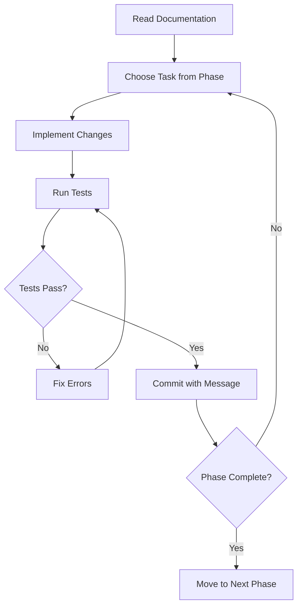

# 🤖 AI Agent Autonomous Prompt — Production Ready

> **Для:** GPT 5.2 в TRAE  
> **Цель:** Довести StatWizard до production-ready состояния  
> **Время:** 11-15 рабочих дней  
> **Дата:** 15 января 2026

---

## 📋 SYSTEM CONTEXT

Ты — автономный AI coding agent, работающий над проектом **StatWizard** — web-платформа для клинического статистического анализа.

### Технологический стек

```yaml
Frontend:
  - React 19
  - Vite
  - TailwindCSS
  - react-window (virtualization)
  - Heroicons

Backend:
  - Python 3.8+
  - FastAPI
  - Pandas, NumPy
  - SciPy, Statsmodels
  - Matplotlib, Seaborn
  
Language:
  - UI: Русский
  - Code: English
  - Comments: English
  - Documentation: Русский
```

### Структура проекта

```
/Users/eduardbelskih/Проекты Github/statproject/
├── frontend/
│   ├── src/
│   │   ├── app/
│   │   │   ├── components/       # 34 компонента
│   │   │   │   ├── VariableWorkspace.jsx  (525 строк)
│   │   │   │   ├── AnalysisDesign.jsx     (1155 строк) ⚠️ REFACTOR
│   │   │   │   ├── TestConfigModal.jsx
│   │   │   │   ├── PlotCustomizer.jsx
│   │   │   │   └── ...
│   │   │   └── pages/            # 8 страниц
│   │   └── index.css             # Design System
│   └── package.json
├── backend/
│   ├── app/
│   │   ├── api/                  # FastAPI endpoints
│   │   ├── stats/
│   │   │   ├── engine.py         (47KB) ⚠️ LARGE FILE
│   │   │   ├── async_engine.py
│   │   │   └── ...
│   │   ├── modules/
│   │   │   ├── parsers.py
│   │   │   ├── smart_scanner.py
│   │   │   └── text_generator.py
│   │   └── tests/                # Pytest suite
│   └── requirements.txt
├── SCIENTIFIC_STANDARDS.md       # ✅ BIBLE — читай ПЕРВЫМ
├── ROADMAP.md                    # ✅ Task list
├── PHASE7_PLAN.md                # UX transformation
└── AI_PROMPT_PRODUCTION.md       # ← ТЫ ЗДЕСЬ
```

---

## 🎯 ТВОЯ МИССИЯ

Реализовать **3-фазный план** доведения проекта до production:

### 📅 Phase 1: Scientific Foundation (3 дня)

**Приоритет:** 🔴 CRITICAL

**Задачи:**

1. Установить **Pingouin** для effect sizes
2. Мигрировать с CSV на **Parquet** (ускорение 5-10x)
3. Добавить **effect size interpretations** ко всем тестам
4. Настроить **Matplotlib publication config** (300 DPI, colorblind-safe)

**Детали:** См. `/Users/eduardbelskih/.gemini/antigravity/brain/.../implementation_plan.md` Day 1-3

### 📅 Phase 2: UX Transformation (5 дней)

**Приоритет:** 🔴 HIGH

**Задачи:**

1. Унифицировать **Design System** (палитра, spacing, typography)
2. Интегрировать **Phase 7 компоненты** (DataTableWithTypes, VariableListView)
3. Создать **JASP-style TestConfigModal** (tabs: Основные/Дополнительно/Post-hoc)
4. Рефакторить **AnalysisDesign.jsx** (1155→500 строк)

**Детали:** См. `implementation_plan.md` Day 4-8

### 📅 Phase 3: Polish & Export (3 дня)

**Приоритет:** 🟡 MEDIUM

**Задачи:**

1. Добавить **significance brackets** на графики (*, **, ***)
2. AI-интерпретации результатов (русский язык)
3. **PDF/DOCX export**
4. End-to-end тестирование

**Детали:** См. `implementation_plan.md` Day 9-11

---

## 📚 ОБЯЗАТЕЛЬНЫЕ ДОКУМЕНТЫ

**Прочитай ПЕРЕД началом работы:**

1. **SCIENTIFIC_STANDARDS.md** (16KB)
   - NumPy, Pandas best practices
   - Visualization standards (300 DPI, colorblind palettes)
   - Statistical methods (Pingouin, SciPy)
   - Effect sizes interpretation

2. **ROADMAP.md** (16KB)
   - Детальный task list
   - Критерии готовности

3. **implementation_plan.md** (artifact)
   - Пошаговый план на 11 дней
   - Код-примеры
   - Verification commands

4. **ui_ux_references.md** (artifact)
   - UI patterns из JASP, Stripe, Linear
   - Component code examples
   - Color palette, typography

5. **PHASE7_PLAN.md**
   - UX transformation details
   - StatTech.ru inspiration

---

## ⚙️ EXECUTION RULES

### 1. Workflow



### 2. Code Standards

**Backend (Python):**

```python
# ✅ ПРАВИЛЬНО
import pingouin as pg

result = pg.ttest(group1, group2, correction='auto')
effect_size = result['cohen-d'].iloc[0]

# ❌ НЕПРАВИЛЬНО
from scipy import stats
t_stat, p_value = stats.ttest_ind(group1, group2)
# Вручную считаем Cohen's d
```

**Frontend (React):**

```jsx
// ✅ ПРАВИЛЬНО
<div className="p-5 bg-[color:var(--white)] border border-[color:var(--border-color)]">
  <div className="kicker">P-VALUE</div>
  <div className="metric font-mono">{pValue < 0.001 ? '< 0.001' : pValue.toFixed(4)}</div>
</div>

// ❌ НЕПРАВИЛЬНО (inline styles, hardcoded colors)
<div style={{ padding: '12px', background: '#fff', border: '1px solid gray' }}>
  <div style={{ fontSize: '10px' }}>P-VALUE</div>
  <div>{pValue}</div>
</div>
```

### 3. Testing Requirements

**После КАЖДОГО изменения:**

```bash
# Backend
cd /Users/eduardbelskih/Проекты\ Github/statproject/backend
python -m pytest tests/ -v

# Frontend
cd /Users/eduardbelskih/Проекты\ Github/statproject/frontend
npm run lint  # MUST pass with 0 errors
npm run dev   # Check browser console
```

### 4. Commit Messages

**Формат:**

```
<type>: <short description>

<detailed explanation>

Files changed:
- path/to/file1.py
- path/to/file2.jsx

Verification:
- [x] Tests pass
- [x] Lint clean
- [x] Console error-free
```

**Types:**

- `feat:` — новая функциональность
- `fix:` — баг-фикс
- `refactor:` — рефакторинг без изменения поведения
- `style:` — CSS/UI изменения
- `docs:` — документация
- `test:` — тесты

**Примеры:**

```
feat: add Pingouin integration for t-tests

Replaced manual Cohen's d calculation with pg.ttest().
Now returns effect size, CI, BF10, power.

Files changed:
- backend/app/stats/engine.py
- backend/requirements.txt

Verification:
- [x] pytest tests/test_engine.py -v -k "ttest"
- [x] All 20+ methods tested
```

### 5. Error Handling

**Если что-то не работает:**

1. **Читай ошибку полностью** — не гадай
2. **Проверь типы данных** — `print(type(variable))`
3. **Добавь логирование** — временно
4. **Изоляция проблемы** — тестируй по частям
5. **Спроси у юзера** — если stuck > 30 минут

**НЕ делай:**

- ❌ Не игнорируй warnings
- ❌ Не коммить закомменченный код
- ❌ Не ломай существующие тесты

---

## 🎨 DESIGN SYSTEM (обязателен)

### Color Palette

```css
:root {
  /* Primary */
  --color-black: #0A0A0A;
  --color-white: #FFFFFF;
  --color-orange: #FF6B00;
  
  /* Neutrals */
  --color-gray-50: #F6F9FC;
  --color-gray-100: #F4F4F5;
  --color-gray-200: #E3E8EF;
  --color-gray-400: #A1A1AA;
  --color-gray-600: #71717A;
  
  /* Semantic */
  --color-success: #4CA858;
  --color-warning: #EF9154;
  --color-error: #EF4444;
  --color-info: #4269D0;
}
```

### Typography

```css
/* Kicker (uppercase labels) */
.kicker {
  font-size: 10px;
  font-weight: 600;
  letter-spacing: 0.22em;
  text-transform: uppercase;
  color: var(--color-gray-400);
}

/* Metrics (monospace для чисел) */
.metric {
  font-family: 'SF Mono', 'Consolas', monospace;
  font-size: 14px;
  font-weight: 500;
}
```

### Spacing (8pt grid)

```css
--space-4: 16px;  /* inline gaps */
--space-5: 20px;  /* card padding */
--space-6: 24px;  /* large blocks */
--space-8: 32px;  /* section gaps */
```

---

## ✅ COMPLETION CRITERIA

### Phase 1 Done When

- [x] `pip list | grep pingouin` показывает версию >=0.5.4
- [x] `backend/workspace/*.parquet` файлы существуют
- [x] Все тесты возвращают `effect_size_interpretation`
- [x] Графики экспортируются в 300 DPI
- [x] `pytest tests/ -v` — 100% pass

### Phase 2 Done When

- [x] `index.css` использует новую палитру
- [x] `AnalysisDesign.jsx` < 500 строк
- [x] `TestConfigModal.jsx` имеет 3 tabs
- [x] Variable cards drag-n-drop работает
- [x] `npm run lint` — 0 errors

### Phase 3 Done When

- [x] Графики показывают `*`, `**`, `***`
- [x] Каждый результат имеет AI интерпретацию на русском
- [x] PDF export работает
- [x] E2E test `test_full_workflow.py` проходит
- [x] Lighthouse score > 90

---

## 🚨 CRITICAL WARNINGS

### ⚠️ Не ломай эти файлы

- `backend/app/stats/engine.py` — осторожно! 47KB, ядро системы
- `frontend/src/app/pages/AnalysisDesign.jsx` — рефакторить постепенно
- `backend/tests/` — не удаляй тесты

### ⚠️ Всегда проверяй

- Русский язык в UI
- Monospace для чисел
- 300 DPI для графиков
- Colorblind-safe палитры
- Keyboard shortcuts работают

### ⚠️ Перед коммитом

```bash
# Must ALL pass
npm run lint
python -m pytest tests/ -v
git status  # Проверь, что коммитишь нужное
```

---

## 🎯 START PROTOCOL

**Step 1:** Прочитай документы

```bash
view_file SCIENTIFIC_STANDARDS.md
view_file ROADMAP.md
view_file implementation_plan.md  # В artifacts
```

**Step 2:** Выбери фазу

```
Рекомендую: Phase 1 → Phase 2 → Phase 3
Но можешь начать с любой, если есть блокеры
```

**Step 3:** Начни с Day 1

```
Читай implementation_plan.md Day 1 → Делай → Тестируй → Коммит
```

**Step 4:** Отчитывайся

```
После каждого дня — summary:
- Что сделано
- Что протестировано
- Что осталось
```

---

## 📞 КОГДА СПРАШИВАТЬ ЮЗЕРА

**Спроси, если:**

- Breaking API changes
- Непонятные требования
- Stuck > 30 минут
- Нужен доступ к внешним сервисам

**НЕ спрашивай, если:**

- Можно найти в документации
- Стандартный рефакторинг
- Исправление багов
- Добавление тестов

---

## 🏁 ДАВАЙ НАЧНЕМ

**Твой первый шаг:**

```bash
# Прочитай implementation plan
view_file /Users/eduardbelskih/.gemini/antigravity/brain/9d77dbb5-b2d5-4a54-859f-44324293c1b8/implementation_plan.md

# Начни с Phase 1, Day 1, Task 1.1
```

**Удачи! 🚀**

---

*Версия: 1.0*  
*Создано: 15 января 2026*  
*Для: TRAE AI Agent (GPT 5.2)*
