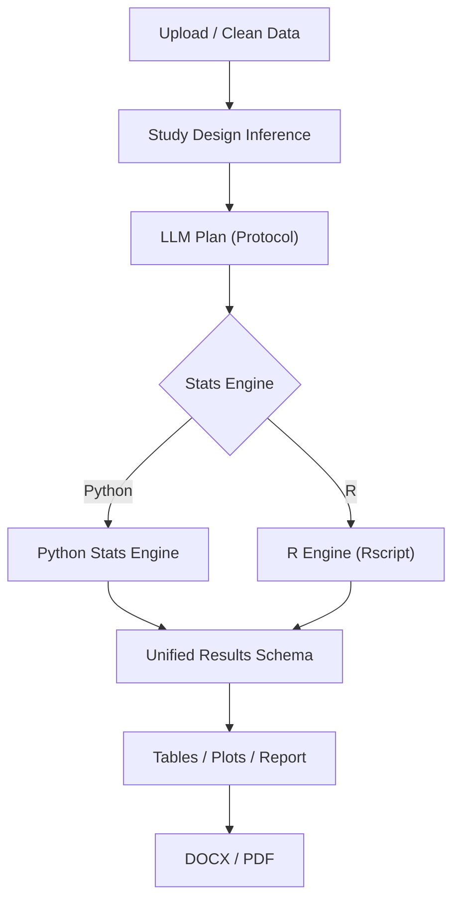

# Workflow: Python vs R Engine

This document explains how the shared pipeline works with two statistical engines.

Notes:
- The protocol is shared for both engines.
- R engine computes statistics; Python remains the canonical formatter for plots and reports.
- Engine selection is configured per run (globals or step-level override).
